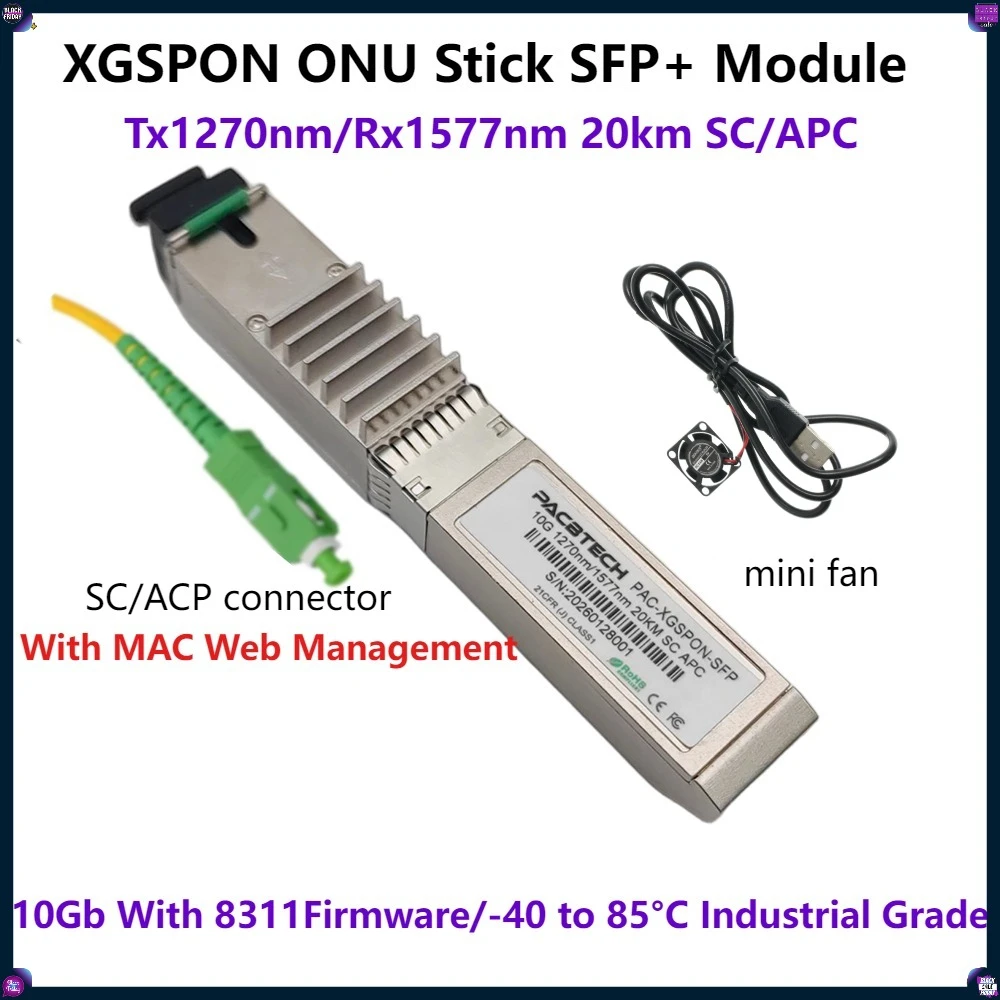

# Jak na vlastní optický SFP od CETIN (O2, T-Mobile, Vodafone)

Návod, jak nahradit ONT od operátora SFP+ stickem s čipem **PRX126** (WAS-110 / 8311 firmware) na **XGS-PON přípojce CETIN**. Platí pro všechny tři retail značky na téže síti: **O2, T-Mobile i Vodafone**. VLAN 848 je od CETIN, PPPoE údaje se liší podle operátora.

Stick **klonuje sériové číslo původního ONT**. CETIN OLT pouští zařízení podle GPON SN, které už na přípojce má — nové číslo sticku nikam nehlásíš a na technickou podporu s „vlastním ONT“ nemusíš. Původní krabičku po přepnutí odpoj, ať na vlákně nejsou dvě stejná SN najednou.

Dál: VLAN 848 (PPPoE) přes CRS do routeru, management sticku jen na switchi přes NAT.

Ověřeno na:

| Kus | Role |
| --- | --- |
| [XGSPON ONU stick SFP+](https://www.aliexpress.com/item/1005011870780610.html) (PRX126, 8311) | koupený na AliExpress, XGS-PON do SFP+ |
| [CRS354-48G-4S+2Q+](https://mikrotik.com/product/crs354_48g_4splus2qplus) | stick v SFP+, VLAN filtering, NAT na LuCI/SSH |
| [RB5009UG+S+](https://mikrotik.com/product/rb5009ug_s_in) | PPPoE, firewall, NAT, bez VLAN 30 |

Stick jsem bral na [AliExpress](https://www.aliexpress.com/item/1005011870780610.html) — SFP+ XGS-PON ONU (MaxLinear PRX126), SC/APC, 1270/1577 nm, s 8311 firmware a malým ventilátorem v balení. Konkrétní inzerát se může změnit, hledej „XGSPON ONU STICK 8311“.



Stick je v **CRS354**, ne v routeru. CRS má na SFP+/QSFP klecích slušné chlazení, takže PRX126 (který topí) tam dává smysl. CPU CRS je ale slabé (MIPS) — na PPPoE, firewall a domácí provoz nestačí. Routing proto běží na **RB5009**, CRS zůstane switchem.

Firmware: [8311-was-110-firmware-builder](https://github.com/djGrrr/8311-was-110-firmware-builder), instalace: [pon.wiki](https://pon.wiki/guides/install-the-8311-community-firmware-on-the-was-110/). Kdybys místo klonování chtěl hlásit **nové** SN sticku, je to jiná cesta — viz [Techforum — vlastní ONT na síti CETIN](https://www.techforum.cz/topic/64188-vlastn%C3%AD-ont-na-s%C3%ADti-cetin/).

## Topologie

```
                         XGS-PON (OLT CETIN)
                                |
                         SC/APC pigtail
                                |
                    +-----------+-----------+
                    |  CRS354-48G-4S+2Q+    |
                    |  sfp-…-xgpon          |
                    |  PVID 30  (untagged)  |
                    |  tagged VLAN 848      |
                    |                       |
                    |  192.168.11.2  VLAN30 |---- NAT ---- 10.0.0.100:8111  web
                    |  10.0.0.100    VLAN10 |              10.0.0.100:2211  ssh
                    +-----------+-----------+
                                | trunk
                                | tagged 10, 848, …
                    +-----------+-----------+
                    |  RB5009UG+S+          |
                    |  vlan-lan 10.0.0.1    |
                    |  OptikaVLAN848        |
                    |  pppoe "optika"       |
                    |  VLAN 30 NENÍ         |
                    +-----------------------+
```

Stick má dvě logické cesty na stejném SFP:

1. **Datová** — tagged VLAN 848, GEM port od OLT, PPPoE končí až na routeru.
2. **Management (LCT)** — untagged Ethernet z ONU. Switch mu dá PVID 30, ať se LAN broadcasty z VLAN 10 necpou do PON.

Router VLAN 30 nevidí. Z LAN, WiFi i z iPhonu se na LuCI jde přes **`http://10.0.0.100:8111/`**.

## VLAN plán

| VLAN | Kde | K čemu |
| --- | --- | --- |
| 10 | LAN, untagged na přístupových portech | domácí síť `10.0.0.0/22` |
| 30 | jen CRS + stick | management ONU `192.168.11.0/24` |
| 848 | tagged: stick, CRS, router | CETIN PPPoE |

Čísla LAN/management si můžeš změnit. **848 je dané od CETIN.**

---

## 1. Stick (PRX126 / 8311)

### `8311_gpon_sn` — opsat z původního ONT

`8311_gpon_sn` je **GPON serial number stávajícího ONT**, které CETIN už na přípojce zná. Stick se jen tváří jako ta samá krabička. Výrobní číslo ze sticku z AliExpressu OLT nezná.

1. Najdi SN na **původním ONT** (ještě než ho odpojíš od vlákna): štítek na spodku / boku, někdy i v jeho webu (PON / Device info). Hledej „GPON SN“, „PON SN“, „Serial Number“, ne LAN MAC.
2. Číslo ze **sticku** (PACBTECH / S/N na modulu) CETIN v OLT nemá — to nechej být.
3. Stejné SN nesmí viset na vlákně dvakrát. Až stick naběhne, původní ONT odpoj.

Často je potřeba zkopírovat i **HW verzi, SW verzi a Equipment ID** ze stejného ONT — OLT je u některých profilů kontroluje.

Do `8311_gpon_sn` patří přesně **12 znaků: 4 písmena výrobce + 8 hex číslic**. `HWTC33AABBCC` níž je jen ukázkový formát — u tebe bude jiné, podle štítku.

```
fw_setenv 8311_gpon_sn HWTC33AABBCC
```

Po změně reboot. Na OLT jsi „registrovaný“, když `pontop -b` ukáže **O5** (PLOAM Associated).

### Když je na štítku 16 hex znaků, odvoď z nich těch 12

ONT občas tiskne SN jako **16 hex číslic** (8 bajtů), ne jako `HWTC…`. Je to totéž SN, jen v surovém hex. První 4 bajty převeď na ASCII (výrobce), zbylé 4 bajty nech hex.

Příklad (zase fiktivní):

```
hex ze štítku:  48 57 54 43 33 AA BB CC
                -- -- -- -- ----------
ASCII výrobce:  H  W  T  C
zbytek hex:                 33AABBCC

do 8311_gpon_sn:  HWTC33AABBCC
```

| Hex | Co s tím |
| --- | --- |
| `48 57 54 43` | převod na písmena → `HWTC` |
| `33AABBCC` | zkopíruješ jak je |

PowerShell (dosadíš **svůj** hex ze štítku):

```
$h = '4857544333AABBCC'
$vendor = -join @(0,2,4,6 | ForEach-Object { [char][Convert]::ToInt32($h.Substring($_,2), 16) })
$vendor + $h.Substring(8).ToUpper()
```

Python:

```
h = '4857544333AABBCC'
print(bytes.fromhex(h[:8]).decode('ascii') + h[8:].upper())
```

Když štítek už ukazuje 12 znaků typu `HWTC33AABBCC`, nic nepřevádíš, jen to opíšeš. Když do `fw_setenv` strčíš plných 16 hex (`4857544333AABBCC`), 8311 to špatně rozparsuje a OLT uvidí **jiné** SN, než má ve smlouvě — stick skončí mimo O5.

### Hookscript nepotřebuješ

Na CETIN (tagged VLAN 848, OLT filtruje samo) **vlastní hookscript není potřeba**. PPPoE prochází bridgem, nic se nepřemapovává.

Firmware 8311 má vestavěné `8311_fix_vlans` a soubor `/ptconf/8311/vlan_fixes_hook.sh`. To je místo pro ruční zásahy u ISP, kde OLT maže VLAN pravidla. U tohoto postupu to nechej prázdné, nebo soubor klidně smaž. Když tam někdo (nebo prodejce) nacpe `uci set gpon.ploam.nSerial='…16 hex…'`, je to špatně — identita patří do `8311_gpon_sn` ve fwenv, v 12znakovém tvaru.

### Management IP

LCT je untagged. IP drž v rozsahu, který **není** tvoje LAN — jinak se ti do PON začnou sypat ARP z domácí sítě.

```bash
fw_setenv 8311_ipaddr 192.168.11.1
fw_setenv 8311_netmask 255.255.255.0
fw_setenv 8311_gateway 192.168.11.2
fw_setenv 8311_dns_server 10.0.0.1
fw_setenv 8311_ntp_servers 10.0.0.1
fw_setenv 8311_timezone Europe/Prague
fw_setenv 8311_ping_ip 192.168.11.2
fw_setenv 8311_dying_gasp_en 1
fw_setenv 8311_https_redirect 0
fw_setenv 8311_fix_vlans 1
```

A rovnou, bez rebootu:

```
uci set network.lct.ipaddr='192.168.11.1'
uci set network.lct.netmask='255.255.255.0'
uci set network.lct.gateway='192.168.11.2'
uci set network.lct.dns='10.0.0.1'
uci commit network
ip route replace default via 192.168.11.2 dev eth0_0_1_lct

uci set system.ntp.enabled='1'
uci -q delete system.ntp.server
uci add_list system.ntp.server='10.0.0.1'
uci commit system
/etc/init.d/sysntpd enable
/etc/init.d/sysntpd restart
```

`dying_gasp_en=1` obsadí UART RX (GPIO 508). Sériová konzole pak nejde používat jako vstup — to je záměr, OLT dostane dying gasp při výpadku napájení.

### LuCI z mobilu

uhttpd defaultně přesměruje na HTTPS a self-signed certifikát. Na iPhonu to končí timeoutem nebo varováním, které nejde odklikat. Vypni redirect:

```bash
fw_setenv 8311_https_redirect 0
uci set uhttpd.main.redirect_https='0'
uci set uhttpd.main.rfc1918_filter='0'
uci commit uhttpd
/etc/init.d/uhttpd restart
```

I tak **neotvírej** `http://192.168.11.1` z iPhonu. iOS Private Relay / Limit IP Tracking bere cizí RFC1918 rozsah jako internet a požadavek zmizí. Používej NAT na switchi (níž).

---

## 2. CRS — VLAN filtering

Předpoklad: bridge má `vlan-filtering=yes`.

### Port se stickem

```rsc
/interface bridge port set [find interface=sfp-sfpplus2-xgpon] \
    pvid=30 frame-types=admit-all ingress-filtering=yes trusted=yes
```

- **PVID 30** — untagged snímky ze sticku = management.
- **admit-all** — musí projít i tagged 848.
- **Nenechávej PVID 10.** Jinak untagged LAN (ARP, mDNS, DHCP) poteče do ONU a dál do PON.

### VLAN 848 jako samostatný řádek

Tohle je nejčastější důvod, proč PPPoE visí v `terminating… peer is not responding`.

Špatně — jeden řádek `vlan-ids=10,20,30,40,50,60,99,848` a ONU port v něm **není** tagged:

```
tagged=bridge,uplink,…
# sfp-sfpplus2-xgpon chybí → 848 na stick nejde
```

Správně — 848 zvlášť a stick **je** tagged:

```rsc
/interface bridge vlan add bridge=bridge vlan-ids=848 \
    tagged=bridge,qsfpplus1-1-router,sfp-sfpplus2-xgpon
```

VLAN 30 na tom portu nechej na dynamickém záznamu z PVID (`untagged=sfp-sfpplus2-xgpon`). Do statického tagged seznamu VLAN 30 ten port **nedávej**: switch by na egress posílal tag 30 a LCT sticku (untagged) by na to nereagoval. Pak `192.168.11.1` nejde pingnout, i když PVID je 30.

### Management IP na CRS

```rsc
/interface vlan add name=vlan_xgpon_management vlan-id=30 interface=bridge
/ip address add address=192.168.11.2/24 interface=vlan_xgpon_management
```

Router tuhle VLAN nemá. Stick má default gw `192.168.11.2`.

---

## 3. NAT — web a SSH jen přes switch

iPhone na WiFi (`10.0.0.0/22`) se na `192.168.11.1` nedostane, notebook na stejné WiFi ano. ICMP na telefon přitom chodí. Jde o to, že `192.168.11.0/24` není lokální podsíť telefonu.

Řešení: DNAT na LAN adresu CRS.

```rsc
/ip firewall nat add chain=dstnat protocol=tcp dst-address=10.0.0.100 \
    dst-port=8111 action=dst-nat to-addresses=192.168.11.1 to-ports=80 \
    comment="ONU web"
/ip firewall nat add chain=dstnat protocol=tcp dst-address=10.0.0.100 \
    dst-port=2211 action=dst-nat to-addresses=192.168.11.1 to-ports=22 \
    comment="ONU ssh"
/ip firewall nat add chain=srcnat out-interface=vlan_xgpon_management \
    action=masquerade comment="ONU mgmt masq"
```

| Služba | Adresa |
| --- | --- |
| LuCI | `http://10.0.0.100:8111/` |
| SSH | `ssh -p 2211 root@10.0.0.100` |

Masquerade je nutný: odpověď ze sticku se musí vrátit na CRS (192.168.11.2), ne rovnou na WiFi klienta. CRS jinak nemá ARP na telefon a SYN-ACK se ztratí.

www na CRS nech vypnuté (`/ip service disable www`), ať port 80 na switchi nikdo neplete s 8111.

---

## 4. Router — jen PPPoE

Přípojka je vždy CETIN, internetová VLAN je vždy **848**. Liší se jen PPPoE jméno a heslo podle toho, kdo ti službu fakturuje:

| Operátor | Uživatel | Heslo |
| --- | --- | --- |
| O2 | `O2` | `O2` |
| Vodafone | `vf` | `vf` |
| T-Mobile | vlastní účet | vlastní heslo |

T-Mobile nemá univerzální `O2`/`vf`. Účet je typicky ve tvaru `optin……@optin.t-mobile.cz`; heslo máš ve smlouvě, nebo ho pošle podpora. (Oficiální tabulka T-Mobile pro FTTx přes CETIN převodník uvádí i `adsl` / `adsl` — pokud osobní účet nemáš, zkus tohle.)

```
/interface vlan add name=OptikaVLAN848 vlan-id=848 interface=bridge
/interface pppoe-client add name="optika internet" interface=OptikaVLAN848 \
    user="O2" password="O2" add-default-route=yes use-peer-dns=yes
```

U Vodafone dej `vf`/`vf`, u T-Mobile svůj účet. VLAN 848 musí být tagged na uplinku ke CRS. MTU 1492.

Na routeru:

- žádný `vlan-xgpon-mgmt`
- žádná routa `192.168.11.0/24` ani `192.168.11.1/32`
- VLAN 30 pryč z `bridge vlan` tagged seznamu

---

## 5. Kontrola

Na CRS:

```rsc
/ping 192.168.11.1 count=4
/interface bridge vlan print where vlan-ids=848
/interface bridge port print detail where interface~"xgpon"
```

U VLAN 848 musí být `current-tagged` včetně portu se stickem. U portu `pvid=30`.

Na sticku (přes `ssh -p 2211`):

```bash
ip route          # default via 192.168.11.2
pontop -b         # O5, GEM port má TX i RX
```

Na routeru:

```rsc
/interface pppoe-client monitor 0 once
# status: connected
```

Z notebooku i z telefonu:

```text
http://10.0.0.100:8111/
```

Přímé `http://192.168.11.1` z LAN má timeout — to je správně.

---

## Proč to takhle

Podrobnosti a slepé uličky jsou v [docs/troubleshooting.md](docs/troubleshooting.md). Krátce:

1. **PPPoE nejede** — 848 není tagged na portu se stickem.
2. **ONU nejde pingnout po přesunu na VLAN 30** — port je zároveň tagged člen VLAN 30.
3. **Broadcast z LAN v PON** — PVID 10 na ONU portu.
4. **iPhone timeout, notebook OK** — cizí RFC1918 + Private Relay; proto NAT na `10.0.0.100`.
5. **Asymetrický routing přes router** — nechej VLAN 30 jen na CRS.

## Licence

MIT. Doplň si vlastní GPON SN, hesla a názvy portů. Do gitu nepatří sériová čísla ONT ani password hashe.
